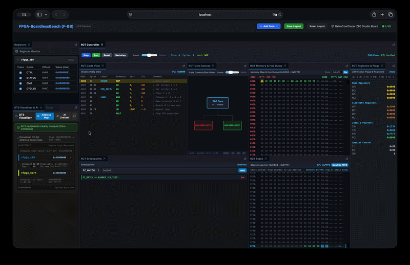
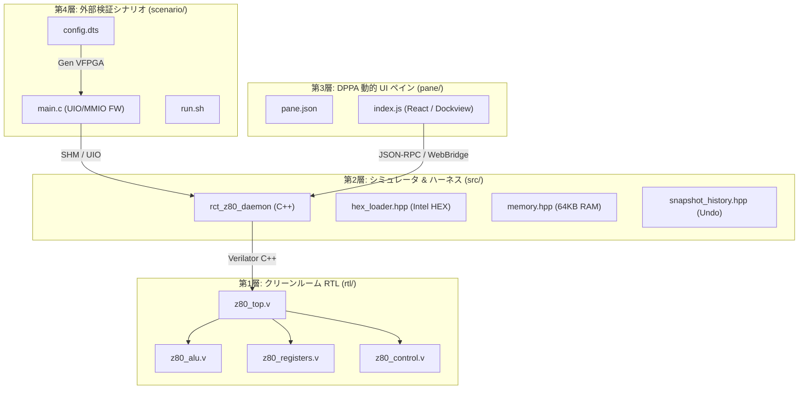

# RetroCoreTracer for F-BB (RetroCoreTracer-FBB)

**RetroCoreTracer-FBB** は、[FPGA-BoardlessBench (F-BB)](https://github.com/sirosiro/FPGA-BoardlessBench) の **PPA 5.1 (Peripheral Plugin Architecture)** および **DPPA v1.0 (Dashboard Pane Plugin Architecture)** を実証・ドッグフーディングするために開発された、外部独立型の Z80 CPU RTL ビジュアルトレーサー＆スタジオプラグインです。

クリーンルーム（完全スクラッチ）から設計された Verilog-2001 Z80 CPU コア、C++ サイクルシミュレータ、決定論的タイムトラベル（Undo / Backstepping）エンジン、および Web ダッシュボード統合の 4 カラム・リッチスタジオ UI を提供します。F-BB 本体のコードを 1 行も変更することなく、完全なプラグアンドプレイを実現しています。



---

## 主な特徴 (Key Features)

1. **クリーンルーム自作 Verilog-2001 RTL (100% MIT ライセンス)**:
   - 既存の GPL / LGPL 実装（TV80 や T80 等）に一切依存せず、ゼロベースから命令デコーダ・ALU・レジスタファイルを構築。知的財産権の懸念がなく、教材・商用利用にも最適です。
   - バス光彩（Bus Glow）用プローブピンおよびスナップショット状態復元ポート（Undo ポート）をハードウェアレベルでネイティブ装備。

2. **決定論的タイムトラベル (Backstepping / Undo)**:
   - リングバッファによる `SnapshotHistory` を備え、命令サイクルごとの全レジスタ・フラグ・バス信号・PC を完全保存。
   - 実行済みのサイクルを過去方向へ巻き戻すバックステップ（タイムトラベル実行）をサポート。

3. **リアルタイム Bus Glow (バス光彩アニメーション)**:
   - MREQ, IORQ, RD, WR, M1 などの制御信号およびアドレス/データバスの活性状態を SVG で動的に可視化。
   - ズームイン/アウト・リセット機能を備えたインタラクティブなコア・キャンバス。

4. **DPPA v1.0 準拠 4 カラム統合スタジオ UI**:
   - **Code View**: 逆アセンブルリストとリアルタイム PC ハイライト。
   - **Memory Map**: 64KB アドレス空間の領域別カラービジュアライザ。
   - **Core Canvas**: Bus Glow SVG およびズーム操作。
   - **Breakpoints**: アドレス一致（PC_MATCH）等のブレークポイント登録・管理。
   - **Flags**: S, Z, H, PV, N, C 各フラグのビット表示。
   - **Hex Dump & Stack**: リアルタイムメモリダンプおよびスタックポインタ（SP）追従ビュー。
   - **Registers**: Main (AF, BC, DE, HL), Alternate (AF', BC', DE', HL'), Index (IX, IY), Special (SP, PC, I, R, IM) の完全表示。
   - **Top Toolbar**: Step, Run, Stop, Reset, Backstep, 実行クロックスピード調整スライダー。

5. **F-BB コア非侵襲アーキテクチャ (Zero Core Modification)**:
   - `~/.fbb/plugins/rct-z80` のシンボリックリンクにより F-BB 側にプラグインとして自動登録。
   - `fbb plugin list`、`fbb plugin validate`、`fbb test`、`fbb lab` (および `./start_lab.sh`) からシームレスに認識・起動。

---

## 4層アーキテクチャ (4-Layer Architecture)



- **第1層: ハードウェア RTL 層 (`rtl/`)**: Verilog-2001 準拠の Z80 プロセッサコア。Verilator によるサイクル精度シミュレーションを前提に最適化。
- **第2層: シミュレータ＆ハーネス層 (`src/`)**: 64KB RAM、Intel HEX パーサ、スナップショット履歴バッファ、UNIX ソケット / JSON-RPC 通信デーモン。
- **第3層: DPPA 動的ペイン層 (`pane/`)**: F-BB ダッシュボードの Dockview にホットマウントされる React ESM コンポーネント。
- **第4層: 外部検証シナリオ層 (`scenario/`)**: F-BB の Device Tree (`config.dts`)、C-Shim、UIO ドライバと連携するエンドツーエンド検証環境。

---

## ディレクトリ構成 (Directory Structure)

```text
RetroCoreTracer-FBB/
├── ARCHITECTURE_MANIFEST.md    # 憲法・設計マニフェスト (ADR #001〜#003 収録)
├── CMakeLists.txt              # Verilator RTL + C++ ハーネス統合ビルド定義
├── fbb-plugin.json             # F-BB PPA 5.1 プラグインマニフェスト
├── README.md                   # 本ドキュメント
├── rtl/                        # クリーンルーム Verilog RTL
│   ├── README.md               # RTL アーキテクチャ・ステートマシン仕様書
│   ├── z80_top.v               # トップモジュール (プローブピン・Undoポート)
│   ├── z80_alu.v               # 8-bit ALU (S/Z/H/PV/N/C 完全フラグ演算)
│   ├── z80_registers.v         # レジスタファイル (裏レジスタ・IX/IY・プローブ)
│   └── z80_control.v           # 命令デコーダ & サイクル実行ステートマシン
├── src/                        # C++ シミュレーションハーネス & デーモン
│   ├── hex_loader.hpp          # Intel HEX ファイルパーサ
│   ├── memory.hpp              # 64KB 同期 RAM モデル
│   ├── snapshot_history.hpp    # 決定論的タイムトラベル用リングバッファ
│   ├── z80_daemon.hpp / .cpp   # JSON-RPC / テレメトリデーモン
│   └── main.cpp                # スタンドアロン CLI エントリポイント
├── pane/                       # DPPA v1.0 動的 UI ペイン
│   ├── pane.json               # DPPA メタデータマニフェスト
│   └── index.js                # 4カラム統合スタジオ UI (ESM React)
├── scenario/                   # F-BB 外部検証テストシナリオ
│   ├── config.dts              # Device Tree (Z80 UIO & UART 定義)
│   ├── main.c                  # シナリオ検証ファームウェア (MMIO)
│   ├── CMakeLists.txt          # シナリオビルド設定
│   ├── run.sh                  # シナリオ起動ランナースクリプト
│   └── vfpga_device_config.h   # IntelliSense / clangd 用事前生成ヘッダー
└── examples/                   # テスト用 Z80 プログラム
    └── fibonacci.hex           # フィボナッチ数列計算デモ (Intel HEX)
```

---

## コード規模統計 (cloc)

プロジェクト全体の純粋なプログラム規模（Pure LOC: コメント・空行を除いた実コード行数）の測定結果です。

```text
-----------------------------------------------------------------------------------
Language                         files          blank        comment           code
-----------------------------------------------------------------------------------
Verilog-SystemVerilog                4             88             62            651
JavaScript                           1             37             42            444
C++                                  2             46              9            274
C/C++ Header                         5             46             11            262
CMake                                2             11              0             60
C                                    1             11              1             46
JSON                                 2              0              0             33
Bourne Shell                         1              3              3             18
-----------------------------------------------------------------------------------
SUM:                                18            242            128           1788
-----------------------------------------------------------------------------------
```
*(ドキュメント Markdown 等を含む総コード行数は 2,182 行)*

---

## ビルド & 実行方法 (Usage)

### 1. スタンドアロンでのビルドと単体テスト
Verilator と CMake を使用して、RTL のコンパイルおよびシミュレータバイナリをビルドします。

```bash
cd /workspaces/RetroCoreTracer-FBB
cmake -B build
cmake --build build
```
ビルド完了後、`bin/rct_z80_daemon` が生成されます。

### 2. 単体セルフテスト（前進実行＆Backstepping）の確認
```bash
./bin/rct_z80_daemon --test
```
フィボナッチ数列プログラムのロード、前進クロックステップ実行、およびバックステップ（Undo）による過去状態復元がコンソール上で検証されます。

### 3. F-BB へのプラグイン認識と仕様検証
F-BB の統一 CLI を使用してプラグインの認識状況と適合性を確認します。

```bash
cd /workspaces/FPGA-BoardlessBench

# プラグイン一覧の表示 (Hybrid / Ready (Binary) として表示されます)
./bin/fbb plugin list

# PPA プラグイン仕様検証
./bin/fbb plugin validate ~/.fbb/plugins/rct-z80

# DPPA 動的ペイン仕様検証
./bin/fbb plugin validate ~/.fbb/plugins/rct-z80/pane
```

### 4. F-BB テストランナーによるエンドツーエンド検証
F-BB のシミュレーションフレームワーク（C-Shim + Verilator + MMIO）を通じてシナリオを自動実行します。

```bash
./bin/fbb test /workspaces/RetroCoreTracer-FBB/scenario/
```

### 5. Web ダッシュボードによるインタラクティブ実行
統合ランナーを起動し、ブラウザからビジュアルトレーサーを使用します。`start_lab.sh` の第2引数に対象の `.hex` ファイルを指定することで、任意の Z80 プログラムを Code View およびシミュレータへ即時ロードして実行可能です。

```bash
# 1. 任意の HEX ファイル（ループテスト）を指定して起動
./start_lab.sh /workspaces/RetroCoreTracer-FBB/scenario/ examples/z80_loop_test.hex

# 2. スタック・サブルーチン呼出テストを指定して起動
./start_lab.sh /workspaces/RetroCoreTracer-FBB/scenario/ examples/z80_stack_test.hex

# 3. 引数を省略した場合は、デフォルトでフィボナッチ数列デモ (fibonacci.hex) が起動します
./start_lab.sh /workspaces/RetroCoreTracer-FBB/scenario/
```
ブラウザで `http://localhost:8080` を開き、上部メニューの「Add-ons & Robotics」または「Custom Panes」から **RetroCoreTracer (Z80)** ペインを選択すると、フルスタジオ UI が立ち上がり、指定したプログラムの逆アセンブラ行・レジスタ・メモリが自動同期されます。

---

## ライセンス (License)

本プロジェクトは **MIT License** の下で公開されています。商用・非商用問わず、誰でも自由に改変・再配布・利用することが可能です。
