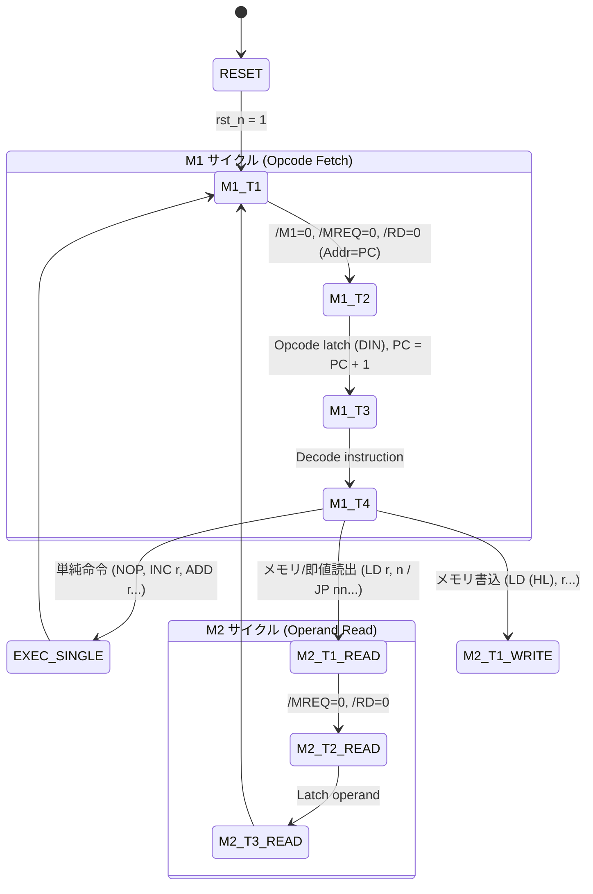

# RetroCoreTracer-FBB Z80 RTL 設計仕様書

本ドキュメントは、**RetroCoreTracer for F-BB (`RetroCoreTracer-FBB`)** のハードウェア層（`rtl/`）における Z80 CPU コアのアーキテクチャ設計、インターフェース仕様、命令実行ステートマシン、および可観測性（Bus Glow / タイムトラベル）のための設計意図を詳述するものである。

---

## 1. モジュール構成と責務分離

RTL は以下の 4 つの独立した Verilog-2001 モジュールで構成され、相互の依存度を最小限に抑えている。

```
┌────────────────────────────────────────────────────────────────────────┐
│ z80_top.v (トップモジュール)                                           │
│  - 外部 Z80 バス信号 (/MREQ, /IORQ, /RD, /WR, /M1, A[15:0], D[7:0])    │
│  - UI 観測用プローブ端子 (probe_*) & Undo 状態注入端子 (restore_*)     │
├──────────────────┬──────────────────┬──────────────────────────────────┤
│ z80_registers.v  │ z80_alu.v        │ z80_control.v                    │
│ ・AF, BC, DE, HL │ ・8-bit 算術論理 │ ・マシンサイクル FSM (M1, M2...) │
│ ・裏レジスタ群   │ ・フラグ更新計算 │ ・命令デコーダ                   │
│ ・IX, IY, SP, PC │   (S,Z,H,PV,N,C) │ ・バスタイミング制御             │
└──────────────────┴──────────────────┴──────────────────────────────────┘
```

---

## 2. 可観測性 (Observability) とタイムトラベル用ポート

RetroCoreTracer の核である **「Bus Glow（バス光彩）」** と **「Backstep（巻き戻し）」** を実現するため、通常の CPU ピンに加え、以下の専用ポートを `z80_top` の外部に明示的に引き出している。

### 2.1. テレメトリ観測用プローブ (Probe Out)
- `probe_pc[15:0]`: 現在実行中のプログラムカウンタ。
- `probe_opcode[7:0]`: 現在フェッチ・デコード中のマシン語命令。
- `probe_af[15:0]`, `probe_bc[15:0]`, `probe_de[15:0]`, `probe_hl[15:0]`: メインレジスタ。
- `probe_af_alt[15:0]`, `probe_bc_alt[15:0]`, `probe_de_alt[15:0]`, `probe_hl_alt[15:0]`: 裏レジスタ。
- `probe_ix[15:0]`, `probe_iy[15:0]`, `probe_sp[15:0]`: インデックス・スタックポインタ。
- `probe_flags[7:0]`: フラグビット（S, Z, Y, H, X, PV, N, C）。
- `probe_bus_active`: アドレス/データバスアクセス中フラグ（UIの光彩トリガー）。

### 2.2. タイムトラベル（Undo 復元）用インジェクションポート (Restore In)
- `restore_en`: 1 の時、通常クロック進行を停止し、外部からレジスタ状態を直接上書き復元する。
- `restore_pc`, `restore_af`, `restore_bc`, `restore_de`, `restore_hl`, `restore_sp` 等。

---

## 3. 命令実行ステートマシン (FSM)

Z80 の標準的なマシンサイクル（M1〜M5）と T ステート（T1〜T4）をモデル化している。



---

## 4. 初期実装命令セット (Phase 1 ターゲット)

Phase 1 では、可観測性とタイムトラベルの完全実証を最優先とし、以下の代表命令をサポートする：

| 分類 | 命令 | バイト数 / サイクル | 動作概要 |
| :--- | :--- | :--- | :--- |
| **基本制御** | `NOP` (`0x00`) | 1 byte / 4T | 何もせず PC を進める |
| | `HALT` (`0x76`) | 1 byte / 4T | 実行停止（割り込みまたはリセット待ち） |
| **レジスタ転送** | `LD r, r'` (`0x40-0x7F`) | 1 byte / 4T | レジスタ間転送 (`LD B, C`, `LD A, B` 等) |
| | `LD r, n` (`0x06, 0x0E...`) | 2 bytes / 7T | 8-bit 即値ロード (`LD A, $55` 等) |
| | `EX DE, HL` (`0xEB`) | 1 byte / 4T | DE と HL の内容を交換 |
| | `EX AF, AF'` (`0x08`) | 1 byte / 4T | AF と裏レジスタ AF' を交換 |
| | `EXX` (`0xD9`) | 1 byte / 4T | BC/DE/HL と BC'/DE'/HL' を一括交換 |
| **算術論理演算** | `INC r` / `DEC r` | 1 byte / 4T | レジスタのインクリメント/デクリメント |
| | `ADD A, r` / `SUB A, r` | 1 byte / 4T | A レジスタとの加減算とフラグ更新 |
| | `AND r` / `OR r` / `XOR r`| 1 byte / 4T | ビット論理演算 |
| **分岐制御** | `JP nn` (`0xC3`) | 3 bytes / 10T | 16-bit アドレスへの無条件ジャンプ |
| | `JR e` (`0x18`) | 2 bytes / 12T | 相対ジャンプ |
